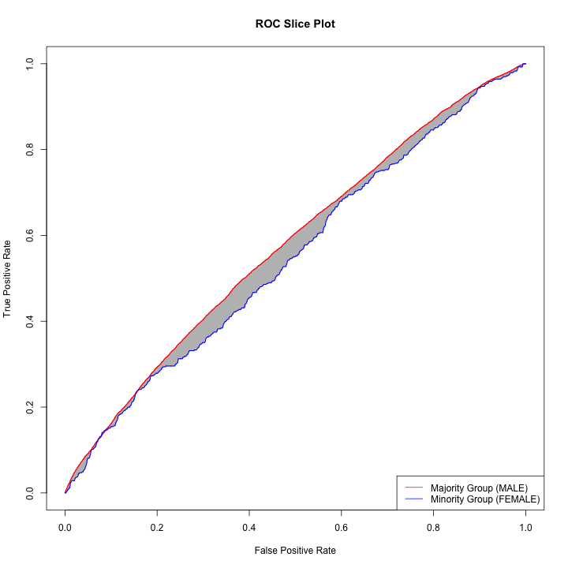

<!-- README.md is generated from README.Rmd. Please edit that file -->

```{r setup, include = FALSE}
knitr::opts_chunk$set(
  collapse = TRUE,
  comment = "#>",
  fig.path = "man/figures/",
  out.width = "100%"
)
```
# abroca

The goal of `abroca` is to provide basic functionality for computing and visualizing the Absolute Between-ROC Area (ABROCA). In future version of the package, we intend to make further statistical testing procedures for ABROCA available.

## Installation

You can install the released version of abroca from [CRAN](https://CRAN.R-project.org) with:

```{r, eval=FALSE}
install.packages("abroca")
```

If you would like to install the latest development version directly from GitHub, you can do so:

```{r, eval=FALSE}
# install.packages("devtools")
devtools::install_github("jpgard/abroca")
```


## Example

This is a basic example which demonstrates the use of the `abroca` package to compute the ABROCA for a simple logistic regression classifier (note that your results may vary due to random sampling):

```{r example}
# install.packages("abroca")
library(abroca)
data("recidivism")
recidivism$returned = as.factor(recidivism$Return.Status != "Not Returned")
in_train = caret::createDataPartition(recidivism$returned, p = 0.75, list = FALSE)
traindata = recidivism[in_train,c("Release.Year", "County.of.Indictment", "Gender", "Age.at.Release", "returned")]
testdata = recidivism[-in_train,c("Release.Year", "County.of.Indictment", "Gender", "Age.at.Release", "returned")]
lr = glm(returned ~ ., data=traindata, family="binomial")
testdata$pred = predict(lr, testdata, type = "response")
abroca <- compute_abroca(testdata, pred_col = "pred", label_col = "returned", 
               protected_attr_col = "Gender", majority_protected_attr_val = "MALE", 
               plot_slices = TRUE, image_dir=".", identifier="recidivism")
print(abroca)

```

The plot is automatically saved to a file instead of being displayed on-screen.

For more information, see:

Josh Gardner, Christopher Brooks, and Ryan Baker (2019). Evaluating the Fairness of Predictive Student Models Through Slicing Analysis. Proceedings of the 9th International Conference on Learning Analytics and Knowledge (LAK19); March 4-8, 2019; Tempe, AZ, USA. https://doi.org/10.1145/3303772.3303791

## Getting help

If you encounter a clear bug, please file a minimal reproducible example on [github](https://github.com/jpgard/abroca/issues), or contact the package maintainers directly (see the package documentation).

[](https://travis-ci.org/jpgard/abroca)
