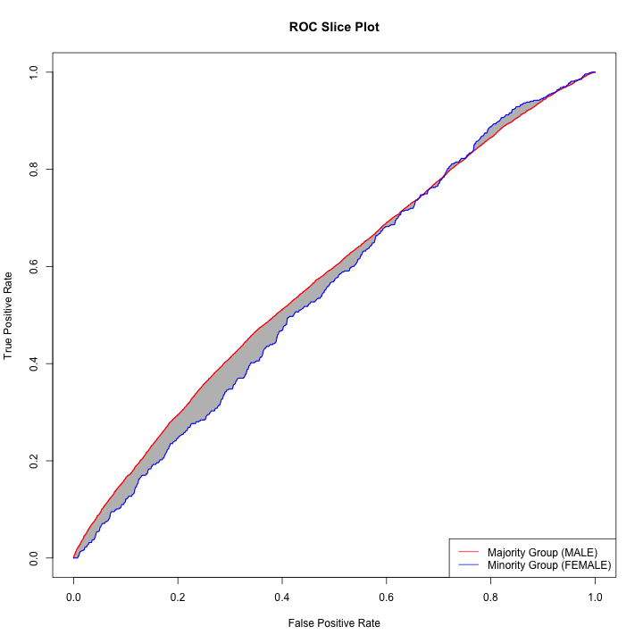

```{r setup, include = FALSE}
knitr::opts_chunk$set(
  collapse = TRUE,
  comment = "#>"
)
```

This vignette introduces the functionality of the ABROCA package and demonstrates its use in comparing two predictive models. We will use a recidivism dataset from the State of New York. The data is included with `abroca`, but can also be obtained from [data.gov](https://catalog.data.gov/dataset/recidivism-beginning-2008).

The data represents return status within three years of release among inmates released to the community during a particular calendar year. Each data record represents a release to the community as a result of completing maximum sentence, reaching conditional release date, or being approved for release by the Board of Parole. The dataset includes data about release year, county of indictment, gender, age at release, and return status.

We will attempt to predict whether an individual returns (for any reason) or whether they do not return.

## Loading the data

```{r}
# install.packages("abroca")
# library(abroca)
devtools::load_all()
data("recidivism") #https://catalog.data.gov/dataset/recidivism-beginning-2008
head(recidivism)
```

To view dataset documentation, including column descriptions:
```{r, results='hide'}
# str(recidivism)
# ?recidivism
```

## Model Comparison using ABROCA

The core of this package consists of tools for comparing predictive models using the Absolute Between-ROC Area (ABROCA). First, we create a train-test split, and fit a simple logistic regression model using four predictors.


```{r}
recidivism$returned = as.factor(recidivism$Return.Status != "Not Returned")
in_train = caret::createDataPartition(recidivism$returned, p = 0.75, list = FALSE)
traindata = recidivism[in_train,c("Release.Year", "County.of.Indictment", "Gender", "Age.at.Release", "returned")]
testdata = recidivism[-in_train,c("Release.Year", "County.of.Indictment", "Gender", "Age.at.Release", "returned")]
lr = glm(returned ~ ., data=traindata, family="binomial")
```

Now, we add a column to the original test data which includes the predicted probabilities, and compute the value of the ABROCA statistic. We can also display the plot which is generated by `compute_abroca()` when we set the parameter `plot = TRUE`.

```{r}
testdata$pred = predict(lr, testdata, type = "response")
abroca <- compute_abroca(testdata, pred_col = "pred", label_col = "returned", 
               protected_attr_col = "Gender", majority_protected_attr_val = "MALE", 
               plot_slices = TRUE, image_dir=".", identifier="recidivism")
print(abroca)

```

